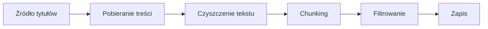
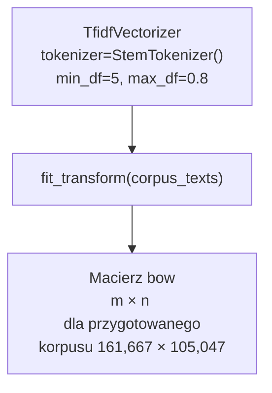
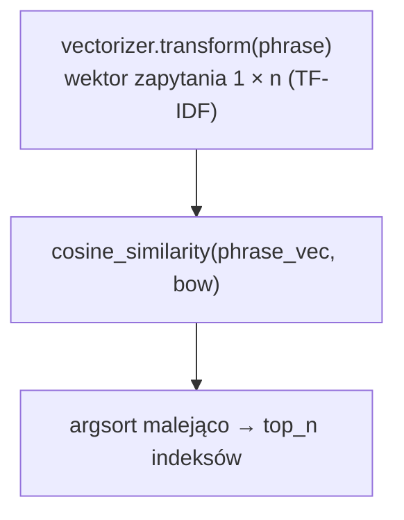
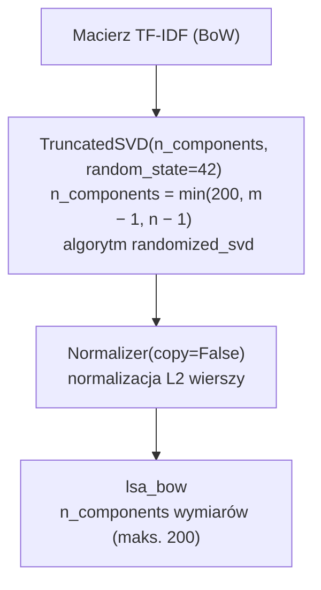
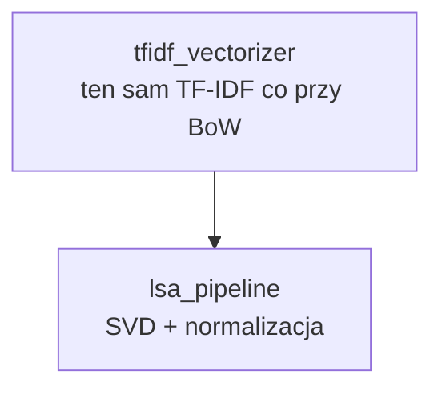
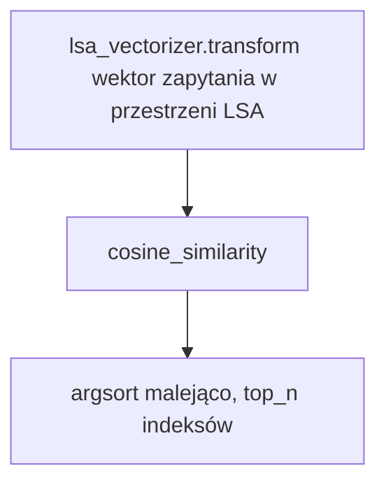
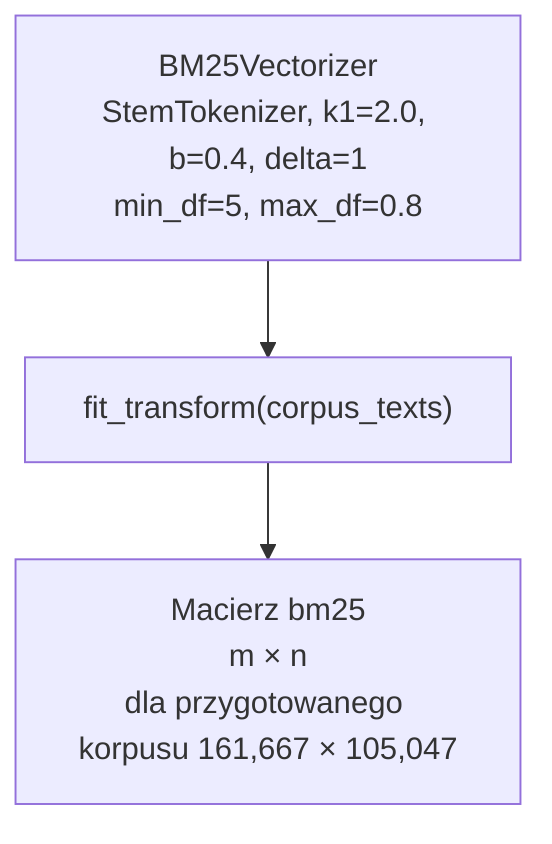
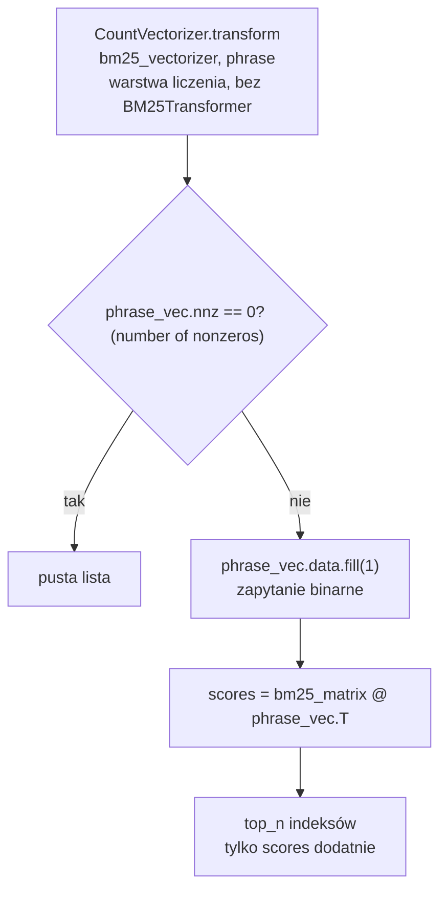

[Demo](./demo.mp4)

# Architektura i uruchomienie

Repozytorium to **monorepo [uv](https://docs.astral.sh/uv/)**.

## Struktura katalogów

```text
browser/
├── pyproject.toml              # workspace root, zależności: client, model, schema
├── uv.lock
├── .python-version
└── packages/
    ├── schema/
    │   ├── pyproject.toml
    │   └── src/schema/
    │       ├── __init__.py     # klasa Document
    │       └── py.typed
    │
    ├── model/
    │   ├── pyproject.toml      # zależność workspace: schema
    │   ├── culture_petscan.csv # wejście do scrapera
    │   ├── artifacts/          # corpus.pkl, bow.pkl, bm25.pkl, … (generowane)
    │   ├── notebooks/
    │   │   └── dataset_analysis.ipynb
    │   └── src/model/
    │       ├── __init__.py     # eksport modeli zapytań
    │       ├── paths.py        # ARTIFACTS_DIR
    │       ├── scraper.py      # build_corpus
    │       ├── tokenizer.py    # StemTokenizer
    │       ├── bm25.py         # BM25Vectorizer, BM25Transformer
    │       ├── main.py         # trening indeksów (entry: build-model)
    │       └── models.py       # BoWModel, LSAModel, BM25Model
    │
    └── client/
        ├── pyproject.toml      # zależność workspace: model
        └── src/client/
            └── main.py         # Gradio UI (entry: run-client)
```

## Uruchomienie

W katalogu głównym repozytorium (wymagany [uv](https://docs.astral.sh/uv/getting-started/installation/)):

```bash
# Jednorazowo: środowisko i wszystkie pakiety workspace
uv sync
```

**Pobrane artefakty** 

Trzeba skopiować do katalogu `packages/model/artifacts/` - m.in. `corpus.pkl`, `bow.pkl`, `vectorizer.pkl`, `lsa_bow.pkl`, `lsa_vectorizer.pkl`, `bm25.pkl`, `bm25_vectorizer.pkl`. Wtedy mona od razu uruchomić UI. Bez tych plików indeksy trzeba wygenerować lokalnie (`build-model`).

**Przygotowanie modeli** 

(wymaga korpusu; przy braku `corpus.pkl` `main.py` uruchomi `build_corpus`):

```bash
uv run build-model
```

**Aplikacja Gradio** 

(wymaga artefaktów w `packages/model/artifacts/`):

```bash
uv run run-client
```

`run-client` jest zdefiniowany w `packages/client/pyproject.toml` (`client.main:main`); `build-model` w `packages/model/pyproject.toml` (`model.main:main`).

# Dataset

Zbiór danych to około 25 tysięcy artykułów z angielskiej Wikipedii kategorii `Culture`. Tytuły artykułów zostały pobrane przy pomocy narzędzia [PetScan](https://petscan.wmcloud.org/), a następnie pobrane przygotowanym skryptem odpytującym API Wikipedii. 

**Nie jest to z definicji web-scraper, ale projekt udostępnia skrypt pozwalający pobrać dowolne artykuły z Wikipedii przy pomocy publicznego API.**

Ponieważ niektóre artykuły są bardzo długie, zostały podzielone na mniejsze fragmenty przy pomocy `langchain_text_splitters.RecursiveCharacterTextSplitter`. Dzięki temu korpus tekstu składa się z 161,667 dokumentów podobnych wielkości, co poprawia jakość wyszukiwania.

```
=============================================
CORPUS TEXT METRICS SUMMARY
=============================================
Total Articles:		             161,667
Average Words/Article:	         234.12
Max Words (Longest):	         451
Min Words (Shortest):	         20
=============================================
```

## Przygotowanie korpusu

Pipeline budowania korpusu działa następująco:




| Etap               | Opis                                                                                                                                                                                                                                                                                   |
| ------------------ | -------------------------------------------------------------------------------------------------------------------------------------------------------------------------------------------------------------------------------------------------------------------------------------- |
| Źródło tytułów     | Plik CSV `culture_petscan.csv`                                                                                                                                                                                                                                                         |
| Pobieranie treści  | `https://en.wikipedia.org/w/api.php`. Odpowiedzi zapytań cacheowane w `artifacts/culture_articles_cache.json`. Skrypt prawidłowo reaguje na prośby o cooldownie zwracane z API Wikipedii, co w miarę gwarantuje, że pobieranie prędzej czy później zakończy się sukcesem, a nie banem. |
| Czyszczenie tekstu | Usuwanie nagłówków w stylu wikitext `== Sekcja ==` oraz obcinanie artykuł przed sekcjami typu References, External links, See also itd.                                                                                                                                                |
| Chunking           | `RecursiveCharacterTextSplitter`, `chunk_size=300` tokenów (`PorterStemmer`), `chunk_overlap=100` tokenów, `length_function=StemTokenizer.token_count` (liczba tokenów po stemowaniu i usunięciu stop-słów).                                                                           |
| Filtrowanie        | Fragmenty krótsze niż `MIN_CHUNK_TOKENS` (20 tokenów) są odrzucane.                                                                                                                                                                                                                    |
| Zapis              | Lista obiektów `Document` (tytuł, tekst fragmentu, URL Wikipedii) serializowana do `artifacts/corpus.pkl` przez `joblib`.                                                                                                                                                              |


Każdy element korpusu to **fragment artykułu** (chunk), nie cały artykuł. Ten sam tytuł może wystąpić w wielu dokumentach.

## Tokenizacja

Wszystkie modele wyszukiwania używają wspólnego `StemTokenizer`:

- normalizacja białych znaków i podział przez `nltk.tokenize.word_tokenize`,
- filtrowanie: tylko tokeny alfabetyczne, bez angielskich stop-słów (`nltk.corpus.stopwords`),
- stemowanie: `PorterStemmer`.

Ten sam tokenizer jest używany przy budowie indeksów i przy zapytaniach użytkownika, co zapewnia spójność słownika.

# Model

Moduł `packages/model` buduje artefakty wyszukiwania (`artifacts/*.pkl`) i udostępnia trzy klasy zapytań w `models.py`: `BoWModel`, `LSAModel`, `BM25Model`. Wspólny kontrakt to `Model.query(phrase, top_n=10) -> list[ModelResponse]`, gdzie `ModelResponse` zawiera `title`, `url`, `score`, `text`.

## Budowa indeksów

Skrypt `python -m model.main`:

1. Ładuje korpus z `corpus.pkl` lub buduje go przez `build_corpus`, jeśli plik nie istnieje.
2. Wyciąga teksty poszczególnych fragmentów artykułów do listy `corpus_texts`.
3. Trenuje i zapisuje trzy reprezentacje (BoW/LSA/BM25) z tymi samymi filtrami słownika: `min_df=5`, `max_df=0.8`.

### Rozmiar słownika

Po załadowaniu modeli z `artifacts/` (np. `len(vectorizer.vocabulary_)`):


| Parametr                      | Wartość           |
| ----------------------------- | ----------------- |
| Rozmiar słownika (BoW / BM25) | 105,047 terminów  |
| Liczba dokumentów             | 161,667           |
| Wymiar macierzy `bow.pkl`     | 161,667 × 105,047 |
| Wymiar macierzy `lsa_bow.pkl` | 161,667 × 200     |


Rozmiar słownika jest dosyć duży, ale ponieważ dataset to artykuły z angielskiej wikipedii (nie simplified-english), a wyszukiwanie działa w porządku, uznałem, że jest ok. W praktyce można zmniejszać słownik dostosowując parametry `min_df` i `max_df`. 

BoW (`TfidfVectorizer`) i BM25 (`BM25Vectorizer`) mają ten sam rozmiar słownika — oba używają `StemTokenizer` oraz `min_df=5`, `max_df=0.8` na tym samym korpusie. LSA redukuje reprezentację do 200 składowych.


| Plik                  | Zawartość                                   |
| --------------------- | ------------------------------------------- |
| `bow.pkl`             | Macierz rzadka TF-IDF dokumentów (`m × n`)  |
| `vectorizer.pkl`      | `TfidfVectorizer` dopasowany do korpusu     |
| `lsa_bow.pkl`         | Macierz dokumentów w przestrzeni LSA        |
| `lsa_vectorizer.pkl`  | Pipeline: TF-IDF > SVD > normalizacja       |
| `bm25.pkl`            | Macierz rzadka wag BM25 dokumentów          |
| `bm25_vectorizer.pkl` | `BM25Vectorizer` (słownik + parametry BM25) |


## Bag of Words (BoW) — TF-IDF

**Trenowanie:**




(`m` — liczba chunków, `n` — rozmiar słownika)

Filtry słownika:

- słowo musi wystąpić w co najmniej 5 dokumentach (`min_df=5`),
- słowo nie może występować w więcej niż 80% dokumentów (`max_df=0.8`).

**Zapytanie (`BoWModel.query`):**




Wynik `score` to wartość podobieństwa cosinusowego z zakresu typowo `[0, 1]`.

## Latent Semantic Analysis (LSA)

**Trenowanie:** na macierzy TF-IDF (`bow`):




**Wektorzator zapytań:**




**Zapytanie:**




Semantycznie: LSA grupuje współwystępowania terminów; wyszukiwanie odbywa się w przestrzeni „tematów” (składowych SVD), a nie surowych tokenów.

## BM25(+)

Ręczna implementacja wzorowana na [BM25-scikit-learn](https://github.com/nocchi1/BM25-scikit-learn/blob/main/bm25.py)


| Komponent                   | Opis                                                                                                                                                |
| --------------------------- | --------------------------------------------------------------------------------------------------------------------------------------------------- |
| `BM25Vectorizer`            | Rozszerza `CountVectorizer`; przy `fit`/`fit_transform` buduje macierz częstości, następnie `BM25Transformer` zamienia ją na wagi BM25.             |
| `BM25Transformer.transform` | Dla każdej niezerowej komórki stosuje wzór BM25 z parametrami `k1`, `b`, opcjonalnie `delta` (BM25+), oraz mnożenie przez `idf_` wyliczone w `fit`. |


**Wzór** (zgodny z `BM25Transformer` w `bm25.py`):

Dla każdej pary (dokument $d$, termin $t$) z niezerową częstością $f(t,d)$ waga w macierzy BM25 to:

```math
w(t,d) = \text{idf}(t) \cdot \left( \frac{f(t,d)\,(k_1 + 1)}{f(t,d) + k_1 \left(1 - b + b\,\dfrac{|d|}{\text{avgdl}}\right)} + \delta \right)
```

gdzie:

- $|d|$ — długość dokumentu (suma liczności wszystkich terminów w $d$),
- $\text{avgdl}$ — średnia długość dokumentu w korpusie (`avgdl_` z `fit`),
- $\delta = 0$ daje klasyczny BM25, $\delta > 0$ daje wariant **BM25+** (w projekcie: $\delta = 1$).

IDF liczone przy `fit` (z wygładzeniem `smooth_idf=True`):

```math
\text{idf}(t) = \log\frac{N + 1}{\text{df}(t) + 1} + 1
```

$N$ — liczba dokumentów w korpusie, $\text{df}(t)$ — liczba dokumentów zawierających termin $t$.

Przy zapytaniu (`BM25Model.query`) wynik dla dokumentu $d$ to suma wag terminów obecnych w zapytaniu (zapytanie traktowane binarnie — bez TF zapytania):

```math
\text{score}(d, q) = \sum_{t \in q} w(t, d)
```

**Parametry w projekcie**:


| Parametr            | Wartość     | Znaczenie                                                                             |
| ------------------- | ----------- | ------------------------------------------------------------------------------------- |
| `k1`                | `2.0`       | Nasycenie częstości terminu w dokumencie                                              |
| `b`                 | `0.4`       | Wpływ długości dokumentu (mniejszy niż typowe 0.75 — mniejsza kara za krótkie chunki) |
| `delta`             | `1`         | Wariant **BM25+** (stały dodatek do wagi)                                             |
| `min_df` / `max_df` | `5` / `0.8` | Jak w TF-IDF                                                                          |
| `norm`              | `None`      | Bez dodatkowej normalizacji L1/L2 po BM25                                             |


**Trenowanie:**




(`m` — liczba chunków, `n` — rozmiar słownika; ten sam słownik co BoW)

**Zapytanie:**




Wynik `score` to surowa suma wag BM25, nie podobieństwo cosinusowe (inna skala niż BoW/LSA).

# Client

- Aplikacja Gradio
- Wyszukiwanie w korpusie Wikipedia (chunki z `corpus.pkl`)
- Wybór **jednego** modelu na zapytanie — `Radio`: `bm25`, `lsa`, `bow`

Zapytanie wysyłane jest przyciskiem Submit lub klawiszem Enter. Puste zapytanie zwraca pustą listę. Wybrany model zwraca do `top_n = 50` fragmentów (`Model.query`).

## Grupowanie wyników

`format_results` łączy trafione chunki w artykuły po tytule. Każdy element listy to `{ title, url, documents: [{ text, score }, ...] }`. Przy wyświetlaniu artykułu wynik główny (`best_score`) to maksimum `score` wśród jego chunków.

## Prezentacja wyników

Dla każdego artykułu UI pokazuje:

- tytuł jako link do Wikipedii,
- `best_score` i kolor wyniku (zależnie od modelu),
- podgląd tekstu pierwszego chunka (pierwsze 512 znaków),
- accordion z listą wszystkich trafionych chunków danego artykułu (z osobnym `score` każdego fragmentu).

| Model    | Format `score` w UI                                |
| -------- | -------------------------------------------------- |
| BoW, LSA | `score × 100` z jednym miejscem po przecinku + `%` |
| BM25     | wartość z 4 miejscami po przecinku                 |

Wyniki trzymane są w `gr.State`; renderowanie listy artykułów jest reaktywne (`@gr.render`).
